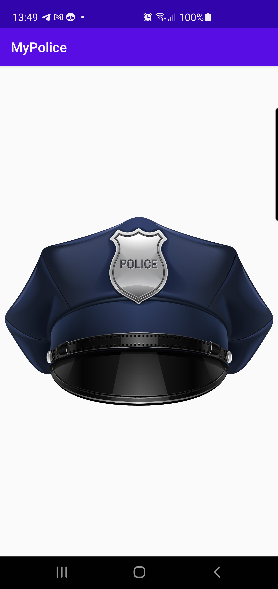

#My police
___

```
Данное приложение было сделано в рамках домашнего задания по курсу Android Kotlin.

```


*Задание на 80 баллов.

    *заменить иконку на сплеш скрине на другую по своему выбору
    *на главном экране где 6 разделов добавить в каждый раздел название и соотв. иконку.
    *сделать чтобы при клике на каждый раздел открывалась соответствующая Activity

___

___
*Задание на 90 баллов.
    *добавить скриншоты и небольшое тектовое описание программы которая получилась на github в README.md файл
